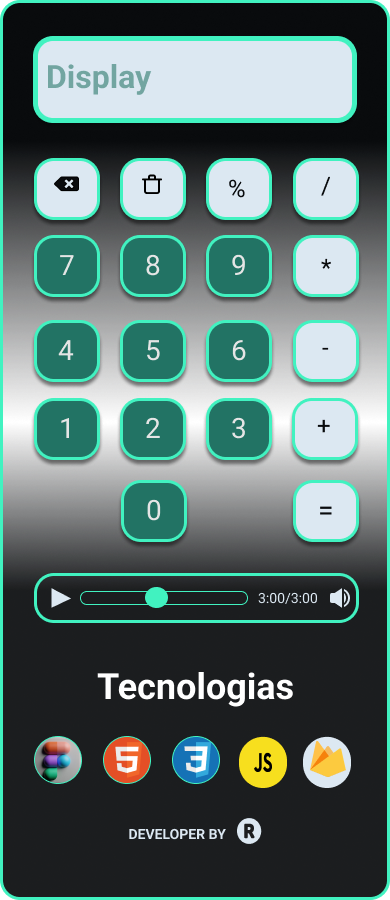

# Projeto-Calculadora

1. Introdução

  Construção de uma calculadora com javascript puro, primeiro projeto desenvolvido no início da minha jornada como programador.

2. Funções e Metodos Utilizadas no Projeto

  innerHTML;
  Operador Ternário;
  Operadores Lógicos;
  Regex;
  split();
  slice();
  join();
  shift();
  document.getElementById();
  Number();

3. Tecnologias Utilizadas no Projeto

  Figma - Protótipo/Planejamento da Interface 
  HTML5;
  CSS3;
  JavaScript Vanilla;
  Firebase

  Link do Projeto no Figma para visualização: link: https://www.figma.com/file/hpMRFnxBzV71MhFTvfHpZc/Untitled?node-id=0%3A1.

  Link do Projeto após o deploy no firebase hosting: https://calculadorajsltech.web.app/ 

  Pontos para Correção

  O navegador safari não carrega adequadamente o CSS do projeto, apresentando algumas falhas.

Imagem do Projeto

  

Desafios

  Para construir esse projeto o primeiro passo foi desenvolver o protótipo da interface, no segundo momento pensei em construir a lógica com base no processo de      digitação dos números no display da calculadora.
